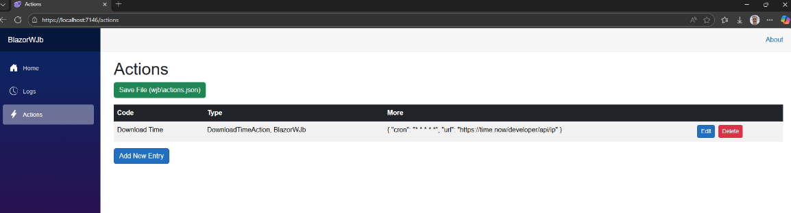

# BlazorWJb Sample

This project demonstrates how to integrate **UkrGuru.WJb** (Worker Jobs) with a **Blazor Server** application. It provides a simple UI for managing actions and viewing logs in real time.

***

## Features

### ✅ Logs Page

Displays job execution logs with:

*   Date filter
*   Level and Category dropdowns
*   Text search
*   Refresh button

### ✅ Actions Page

Allows adding, editing, and deleting actions:

*   Save actions to `wjb\actions.json`
*   Edit JSON parameters for each action

***

## Configuration

*   Actions are stored in `wjb\actions.json`.
*   Logs are displayed from the Log\yyyyMMdd.log files.

***

## How It Works

*   **JobScheduler** runs background jobs based on CRON expressions.
*   **JobProcessor** executes actions defined in the Actions page.
*   Logs are automatically updated after each job execution.

***
